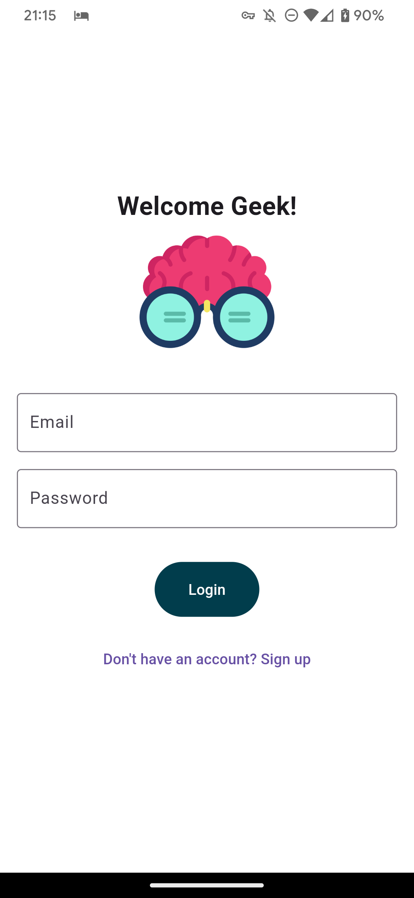
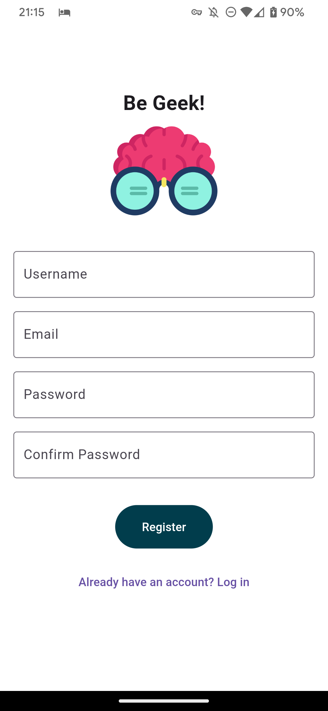
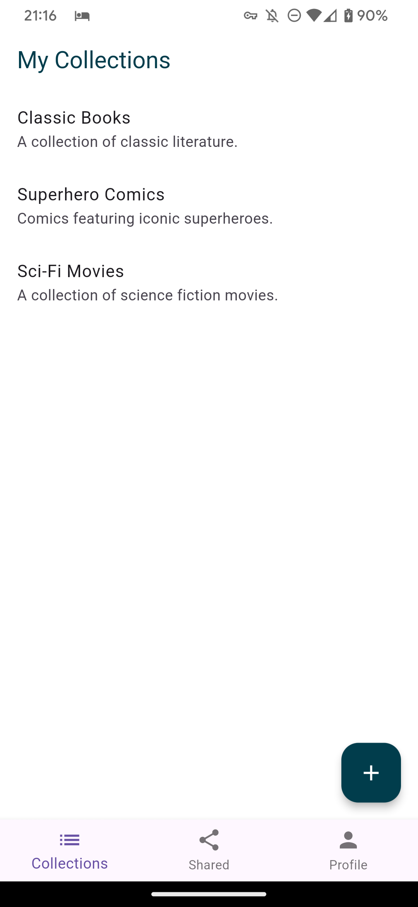
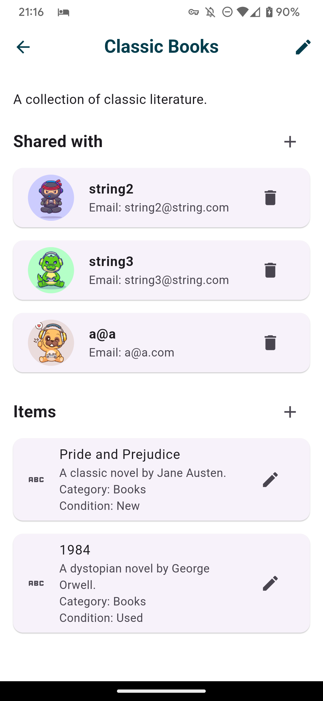
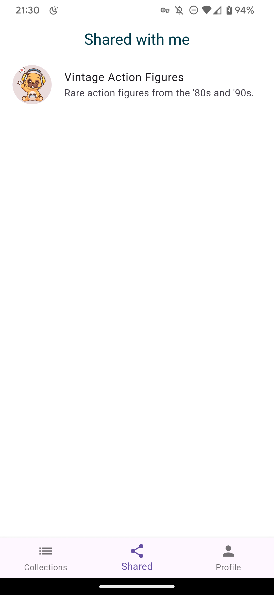
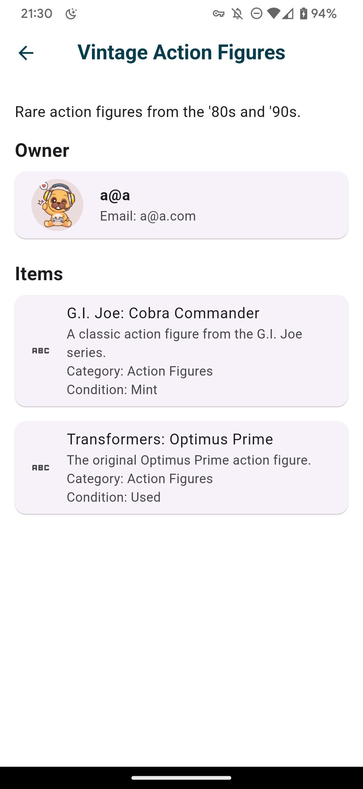

  <h1 align="center">Geek Collection App</h1>
  <h3 align="center"></h3>

An application designed to help collectors of geek items, such as action figures, comics, board games, posters, video games, tech gadgets, etc. The app include features to catalog items, add photos*, manage values and conditions, and share collections with other users.

*feature pending.

See the backend
[Geek Collection Management Api](https://github.com/swczk/GeekCollectionManagementApi)

## Screenshots

### Login

### Sign Up

### Collection

### Collection Detail

### Shared Collection

### Shared Collection Detail

### User Profile

